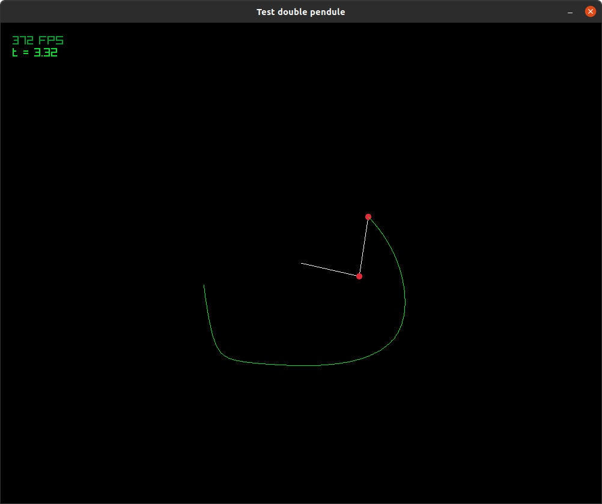

# Programme simulant un double pendule

> [!WARNING]
> Necessite la librairie graphique Raylib

Programme permettant de résoudre numériquement l'équation du double pendule. 
Le programme embarque plusieurs solveur d'EDO comme: RK4, Verlet, Euler et DOPRI45.
La visualisation de cette simulation est effectuée avec Raylib.

## Pour commencer

```console
$ cc double_pendule.c resolveur_EDO.c -o double_pendule -Wall -Wextra -Wno-unused-function -lraylib -lGL -lm -lpthread -ldl -lrt -lX11
$ ./double_pendule
```
## Exemple en image 

[](/)


# Infos interessantes

## Source d'inspiration
> Site Simulatant un double pendule ultra réaliste
https://www.myphysicslab.com/pendulum/double-pendulum-en.html
(Formule dispo en bas de page)

> Code du site
https://github.com/myphysicslab/myphysicslab/blob/master/src/lab/model/AdaptiveStepSolver.ts

## Aide pour l'établissement des équations
> Résolution théorique: Résoudre les équations différentielles en utilisant la transformée de Laplace
> [Résolution celon_Laplace_](https://www.mathforengineers.com/french/Laplace-transform/solve-differential-equations-using-Laplace-transform.html)

> simplification trigonométrique
> [Formule trigo](https://www.mathforu.com/hors-programme/formulaire-de-trigonometrie/)


## visualisation de la Série de Fourier
https://isaacvr.github.io/coding/fourier_transform/

## Equation rugeuse (stiff) qui sont les pires equations pour solveurs explicites
https://en.wikipedia.org/wiki/Backward_differentiation_formula
https://en.wikipedia.org/wiki/Stiff_equation

## Programme solveur explicite DOP853
https://www.unige.ch/~hairer/software.html
