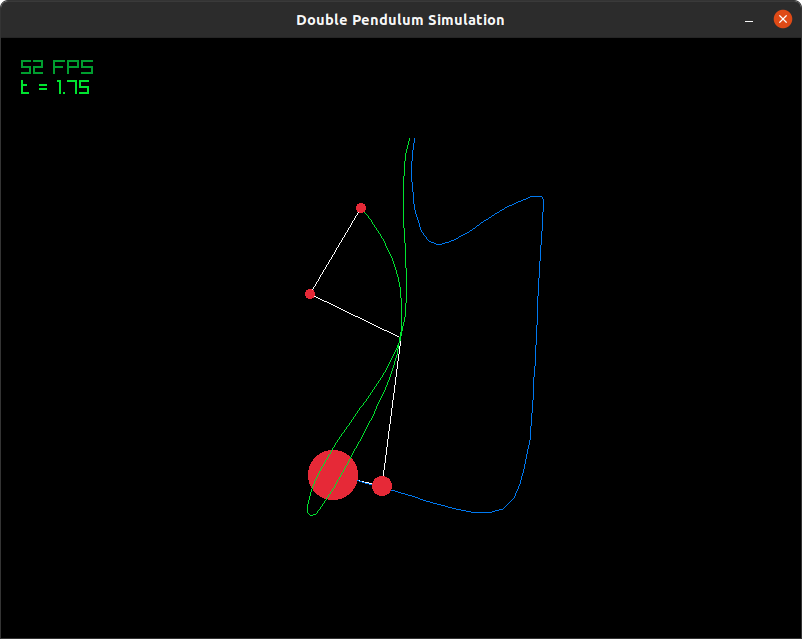
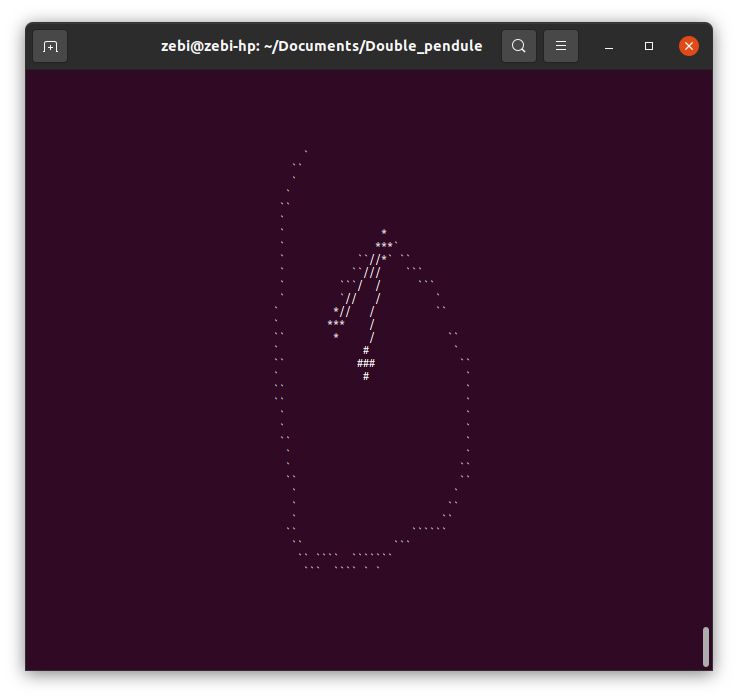
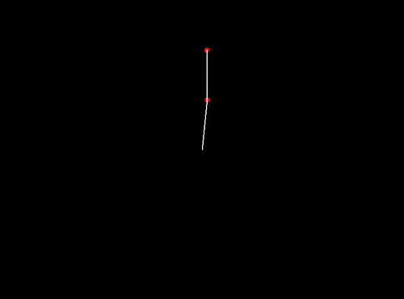

# Programs simulating the double pendulum

> [!WARNING]
> The "double_pendulum" executable needs Raylib to handle graphic parts

Here are 3 programs, one for each different grapical display method such as:
- The program double\_pendulum use Raylib graphical library
- The program double\_pendulum\_video uses its own library to create pictures representing the motion of the double pendulum frame by frame and after that will be concatenated into a video by ffmpeg. Once the video has been, it is possible to load it from the Makefile with mpv.
- The program double\_pendulum\_console uses only its own libs to render the simulation

Here is also an ODE solver library that embed many different methods for solving non-linear equations such as:
- Explicit Euler
- Semi-implicit Euler
- Verlet
- Runge-kutta 4
- Runge-kutta (variable coefficients)
- DOPRI45

## Ready to start

_To compile all the executables_

```console
$ make -k all
```

_To load the simulation from the terminal_

```console
$ ./project/double_pendule_console
```

_To directly compile and play the video_

```console
$ make play_video
```

_To load the simulation with Raylib_

```console
$ ./project/double_pendule
```

_To remove executbles, images and video_

```console
$ make clean
```

## Examples and illustrations

_Exemple with raylib_

[](/picture)

_Exemple with the console mode_

[](/picture)

_Exemple in video in mp4 format_

[](/picture)


# References

## source of inspiration
> Site Simulatant un double pendule ultra réaliste
https://www.myphysicslab.com/pendulum/double-pendulum-en.html
(Formule dispo en bas de page)

> Code du site
https://github.com/myphysicslab/myphysicslab/blob/master/src/lab/model/AdaptiveStepSolver.ts

## Aide pour l'établissement des équations
> Résolution théorique: Résoudre les équations différentielles en utilisant la transformée de Laplace
> [Résolution celon_Laplace_](https://www.mathforengineers.com/french/Laplace-transform/solve-differential-equations-using-Laplace-transform.html)

> simplification trigonométrique
> [Formule trigo](https://www.mathforu.com/hors-programme/formulaire-de-trigonometrie/)


## visualisation de la Série de Fourier
https://isaacvr.github.io/coding/fourier_transform/

## Equation rugeuse (stiff) qui sont les pires equations pour solveurs explicites
https://en.wikipedia.org/wiki/Backward_differentiation_formula
https://en.wikipedia.org/wiki/Stiff_equation

## Programme solveur explicite DOP853
https://www.unige.ch/~hairer/software.html

## Info pour Makefile
https://makefiletutorial.com/


# Writing the double pendulum's equations with Lagrange method

## Reminder of the basics

[](/picture)


## 1. select the degrees of freedom

```math
\theta_1 \text{ and } \theta_2
```

## 2. Select the generalized coordinates

```math
\begin{align}
	x_1 &= l_1\sin\theta_1\\
	y_1 &= -l_1\cos\theta_1\\
	x_2 &= l_2\sin\theta_2 + x_1\\
	y_2 &= -l_2\cos\theta_2 + y_1\\
	\dot{x}_1 &= l_1\dot{\theta}_1\cos\theta_1\\
	\dot{y}_1 &= l_1\dot{\theta}_1\sin\theta_1\\
	\dot{x}_2 &= l_2\dot{\theta}_2\cos\theta_2+\dot{x}_1\\
	\dot{y}_2 &= l_2\dot{\theta}_2\sin\theta_2+\dot{x}_1
\end{align}
```

## 3. Write the kinetic energy

```math
\begin{align}
	T_1 &= \frac{1}{2} m_1 {l_1}^{2} {\dot{\theta}_1}^{2} \\
	T_2 &= \frac{1}{2} m_2 \left({l_1}^{2} {\dot{\theta}_1}^{2} + l_2^{2} {\dot{\theta}_2}^{2} + 2 l_2 l_1 {\dot{\theta}_2} {\dot{\theta}_1} \cos(\theta_1 - \theta_2)\right) \\
	T_{tot} &= \frac{1}{2} \left(m_1 + m_2\right) {l_1}^{2} {\dot{\theta}_1}^{2} + \frac{1}{2} {l_2}^{2} m_2 {\dot{\theta}_2}^{2} + l_1 l_2 m_2 {\dot{\theta}_1} {\dot{\theta}_2} \cos(\theta_1 - \theta_2)
\end{align}
```

## 4. Write the potentiel energy

```math
\begin{align}
	U_1 &= - m_1 g l_1 \cos\theta_1\\
	U_2 &= - m_2 g \left(l_1 \cos\theta_1 + l_2 \cos\theta_2\right)\\
	U_{tot} &= - g l_1 \left(m_1 + m_2\right) \cos\theta_1 - g l_2 m_2 \cos\theta_2
\end{align}
```

## 5. Write the Lagrange equation

```math
\begin{align}
	L &= T_{tot} - U_{tot}\\
	L &= \left[\frac{1}{2} \left(m_1 + m_2\right) {l_1}^{2} {\dot{\theta}_1}^2 + \frac{1}{2} {l_2}^{2} m_2 {\dot{\theta}_2}^{2} + l_1 l_2 m_2 {\dot{\theta}_1} {\dot{\theta}_2} \cos(\theta_1 - \theta_2)\right] - \left[- g l_1 \left(m_1 + m_2\right) \cos\theta_1 - g l_2 m_2 \cos\theta_2\right]
\end{align}
```

## 6. Write the final equation

```math
\text{Energy conservation} \quad
\boxed{
	\frac{d}{dt}\left(\frac{\partial L}{\partial \dot{\theta}}\right) - \frac{\partial L}{\partial \theta} = 0
}
```
```math
\left\{
\begin{aligned}
	\frac{\partial L}{\partial {\dot{\theta}_1}} &= 
		(m_1 + m_2) {l_1}^{2} {\dot{\theta}_1} + l_1 l_2 m_2 {\dot{\theta}_2} \cos(\theta_1 - \theta_2)\\
	\frac{\partial L}{\partial {\dot{\theta}_2}} &= 
		{l_2}^{2} m_2 {\dot{\theta}_2} + l_1 l_2 m_2 {\dot{\theta}_1} \cos(\theta_1 - \theta_2)
\end{aligned}
\right.\\

\left\{
\begin{aligned}
	\frac{d}{dt}\left(\frac{\partial L}{\partial {\dot{\theta}_1}} \right) &= 
		{l_1}^{2} (m_1 + m_2) \ddot{\theta}_1 + l_1 l_2 m_2 \Big[ \ddot{\theta}_2 \cos(\theta_1 - \theta_2) - ({\dot{\theta}_1} - {\dot{\theta}_2}) {\dot{\theta}_2} \sin(\theta_1 - \theta_2)\Big]\\
	\frac{d}{dt}\left(\frac{\partial L}{\partial {\dot{\theta}_2}} \right) &= 
		{l_2}^{2} m_2 \ddot{\theta}_2 + l_1 l_2 m_2 \Big[ \ddot{\theta}_1 \cos(\theta_1 - \theta_2) - ({\dot{\theta}_1} - {\dot{\theta}_2}) {\dot{\theta}_1} \sin(\theta_1 - \theta_2)\Big]\\
\end{aligned}
\right.\\

\left\{
\begin{aligned}
	\frac{\partial L}{\partial {\theta_1}} &= 
		- l_1 l_2 m_2 \dot{\theta}_1 \dot{\theta}_2 \sin(\theta_1 - \theta_2) - g l_1 \left(m_1 + m_2\right) \sin\theta_1\\
	\frac{\partial L}{\partial {\theta_2}} &= 
		l_1 l_2 m_2 \dot{\theta}_1 \dot{\theta}_2 \sin(\theta_1 - \theta_2) + g l_2 m_2 \sin\theta_2
\end{aligned}
\right.
```

```math
\text{Final equation:}\\

\boxed{
	\left\{
	\begin{aligned}
		l_1 \left(m_1 + m_2\right) \ddot{\theta}_1 &+ l_2 m_2 \ddot{\theta}_2 \cos(\theta_1 - \theta_2) + l_2 m_2 {\dot{\theta}_2}^{2} \sin(\theta_1 - \theta_2) + g l_1 \left(m_1 + m_2\right) \sin\theta_1 = 0\\
		l_2 m_2 \ddot{\theta_2} &+ l_1 m_2 \ddot{\theta}_1 \cos(\theta_1 - \theta_2) - l_1 m_2 {\dot{\theta}_1}^{2} + g l_2 m_2 \sin\theta_2 = 0
	\end{aligned}
	\right.
}
```


## Second 

## Desmos

_Remind with labels of the double pendulum_

https://www.desmos.com/calculator/tmpy5hscr1

